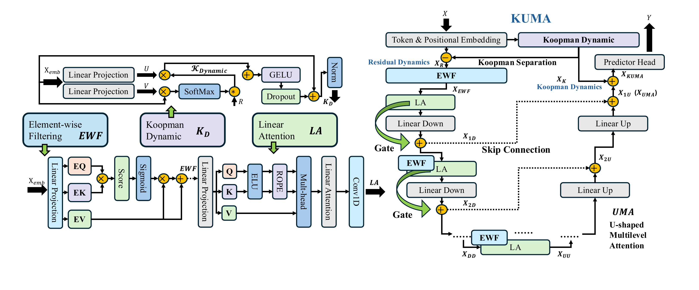

# KUMA

**Koopman Separation and Efficient Multilevel Extraction for Time Series Forecasting**

KUMA is a multivariate forecasting framework that separates an embedded time series into input-dependent Koopman dynamics and residual dynamics. The residual branch is processed by U-shaped Multilevel Attention (UMA), which combines element-wise filtering, RoPE-enhanced linear attention, progressive feature compression, and gated skip fusion.



The figure is taken from the accompanying manuscript. A scalable version is available as [PDF](assets/KUMA.pdf).

## Method at a glance

KUMA is motivated by three forecasting challenges discussed in the paper: temporal distribution shifts, inefficient token utilization, and computational cost. Its implementation has two coordinated parts.

1. **Koopman Dynamic Module (KDM).** An inverted embedding maps each sensor history to a latent token. Two input-conditioned projections generate low-rank bases and coordinates. Their weighted combination estimates the dominant dynamics. KDM is Koopman-inspired; it does not claim to identify an exact, fixed Koopman operator.
2. **U-shaped Multilevel Attention (UMA).** The residual between the embedded input and KDM output is processed at three feature widths. Each level applies element-wise filtering and four-head linear attention with Rotary Position Embedding (RoPE). Gated skip connections restore the feature width while retaining fine information.
3. **Forecast Fusion.** The processed residual dynamics and Koopman dynamics are added before a linear prediction head produces the future sequence.

For an embedded token `x` with latent width `D`, the released KDM computes input-dependent coordinates and a dominant representation:

$$
a = \mathrm{softmax}\left(\frac{V(x)^\top x}{\sqrt{D}}\right),
\qquad
x_K = \mathrm{RMSNorm}\left(\mathrm{Dropout}(\mathrm{GELU}(U(x)a)) + x\right).
$$

The residual branch is then

$$
x_R = x - x_K,
\qquad
\widehat{Y} = \mathrm{Linear}\left(\mathrm{UMA}(x_R) + x_K\right).
$$

These equations summarize the released implementation rather than introducing an additional training objective. Training uses mean squared error and Adam.

## Public release scope

This is a compact, inspection-friendly release with one end-to-end example: **PEMS03**. It includes the model, the PEMS03 data file, a training/evaluation engine, and one launcher. The following author-side artifacts are intentionally excluded:

- the other 11 benchmark datasets and their launchers;
- exploratory plots, statistical-test scripts, and paper-table utilities;
- historical training logs, prediction arrays, checkpoints, and trained weights;
- unused model variants and partial-training code.

The goal is a clean executable reference, not a dump of every file used during paper development.

## Repository structure

```text
.
├── assets/
│   ├── KUMA.pdf
│   └── KUMA.png
├── data_provider/
│   └── data_loader.py
├── dataset/PEMS/
│   └── PEMS03.npz
├── experiments/
│   └── exp_long_term_forecasting.py
├── model/
│   ├── KUMA.py
│   └── kuma_layers.py
├── scripts/
│   └── KUMA_PEMS03.sh
├── run.py
├── requirements.txt
└── LICENSE
```

## Environment

Python 3.10 or later is recommended. For GPU training, first use the [official PyTorch installation selector](https://docs.pytorch.org/get-started/locally/) to install a build compatible with the target CUDA runtime. Then install the remaining requirements:

```bash
python -m venv .venv
source .venv/bin/activate
pip install -r requirements.txt
```

The paper experiments used PyTorch on an NVIDIA A100 GPU with 80 GB memory. The code also supports CPU execution, but full PEMS03 training is intended for a GPU.

## Quick PEMS03 demo

From the repository root, run:

```bash
bash scripts/KUMA_PEMS03.sh
```

The default demo uses 96 historical steps to predict the next 12 steps on the real PEMS03 data. It executes two training batches plus two validation/test batches with a reduced latent width. It is designed to verify the complete data-model-optimization path quickly. Its metrics are **not** comparable to the paper results.

## Full PEMS03 training

Run the disclosed full configuration for the same 96-to-12 task:

```bash
bash scripts/KUMA_PEMS03.sh full
```

The retained full configuration is:

| Input length | Forecast horizon | Seed | Encoder layers | Latent width | Learning rate | Max epochs |
|---:|---:|---:|---:|---:|---:|---:|
| 96 | 12 | 2025 | 1 | 256 | 0.002 | 20 |

All runs use an input length of 96, 358 traffic sensors, batch size 32, Adam, MSE training loss, validation-based early stopping with patience 3, and a learning rate halved after each epoch.

Checkpoints and a JSON Lines result ledger are written under `outputs/`, which is ignored by Git:

```text
outputs/
├── checkpoints/<setting>/checkpoint.pt
└── results.jsonl
```

To evaluate an existing checkpoint, reproduce its arguments and use `--mode test`, for example:

```bash
python run.py --mode test --d_model 256 --d_ff 256 \
  --e_layers 1 --random_seed 2025
```

## PEMS03 protocol

The included array has shape `(26208, 358, 1)`. The demo uses the first feature channel, splits the timeline chronologically into 60% training, 20% validation, and 20% test data, and standardizes every sensor using training-split statistics only. Every sample contains 96 historical steps and a 12-step forecast target.

The manuscript reports the following normalized PEMS03 results. They are included as reference values from the paper, not as outputs of the short demo:

| Forecast horizon | MSE | MAE |
|---:|---:|---:|
| 12 | 0.063 | 0.165 |

Exact reruns can vary with the PyTorch/CUDA stack, hardware, and random execution order. No pretrained checkpoint is included.

# 📖Citation
If you are fond of our work and consider our work helpful to your research, please cite us:
```
@inproceedings{xiong2026kuma,
    
    title={{KUMA: A Novel Framework with Koopman Separation and Efficient Multilevel Extraction in Time Series Forecasting}},
    
    author={Sijie Xiong and Cheng Tang and Atsushi Shimada},
    
    booktitle={Forty-third International Conference on Machine Learning (ICML)},
    
    year={2026}
}
```

## License

The source code is released under the [MIT License](LICENSE). The bundled benchmark data remains subject to the terms of its original provider.
